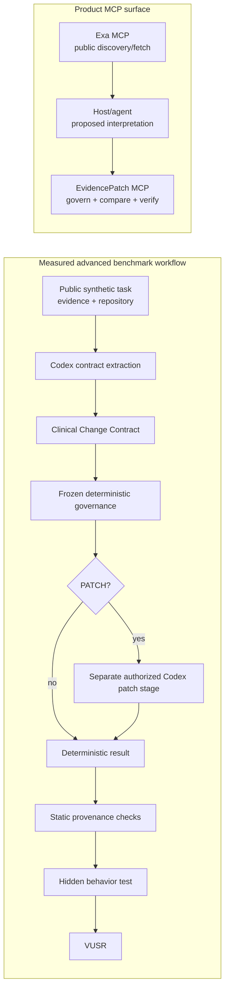

# EvidencePatch

Fresh medical evidence is not automatically actionable medical evidence.

EvidencePatch governs evidence-backed maintenance of clinical-informatics and healthcare software. Its focus is not merely generating code, but establishing whether controlling evidence supports an executable behavior change, handling weaker conflicting evidence safely, and checking that repository changes match their declared provenance. It does not make clinical decisions.

## What EvidencePatch Does

EvidencePatch represents proposed evidence interpretations as a Clinical Change Contract, applies deterministic governance, and verifies the declared result against repository state. The possible dispositions are `PATCH`, `NO_PATCH`, and `ESCALATE`; both `PATCH` and `ESCALATE` require human review.

## Why This Exists

Recency, publication, and authority are different properties. A new peer-reviewed study can create meaningful change pressure without superseding a current regulator or guideline rule. Clinical-software maintenance needs an explicit boundary between discovering evidence, interpreting it, authorizing a change, and verifying what actually changed.

## Architecture

The measured workflow and product MCP surface are related but distinct:



See [Architecture](docs/architecture.md) for the full boundaries and action taxonomy.

## Measured Result

On 12 synthetic medication-safety and clinical-software maintenance cases with `gpt-5.6-sol`:

| Workflow | VUSR | Verified cases |
| --- | ---: | ---: |
| Plain Codex | 91.67% | 11/12 |
| EvidencePatch advanced | 100.00% | 12/12 |
| Measured delta | **+8.33 percentage points** | failures 1 → 0 |

The improvement has a direct compute tradeoff: **1.75× Codex calls** (12 → 21) and **1.83× solver duration** (595.405 → 1090.656 seconds). This is a reliability-versus-compute result, not an equal-inference-budget comparison. It is not a claim of statistical significance or clinical safety.

See the [official comparison](artifacts/official/comparison.md) and [evaluation documentation](docs/evaluation.md).

## MCP Product Surface

Exa MCP performs public evidence discovery and fetching. The host or agent constructs the proposed structured interpretation. EvidencePatch MCP then provides exactly three deterministic tools:

- `assess_change_contract`
- `analyze_repository_impact`
- `verify_result_provenance`

EvidencePatch MCP does not search the web, call Exa or Codex, modify repositories, deploy software, or read benchmark ground truth.

## Public Evidence Demo

The canonical public demo concerns metformin when eGFR falls below 30 mL/min/1.73 m². A current FDA rule says to discontinue metformin for an existing user below that threshold. A later published observational AJKD study supports possible continuation while noting residual confounding and the need for randomized confirmation. The corrected contract classifies both sources as `CURRENT`, but only the FDA source as `AUTHORITATIVE`. EvidencePatch returned `ESCALATE`, the unchanged synthetic repositories compared cleanly, and all five provenance checks passed. This is a software-maintenance disposition, not treatment advice.

See [Public MCP demo](docs/public_mcp_demo.md).

## Quick Start

```bash
python -m pip install -r requirements.txt
PYTHONPATH=. pytest tests -q
```

Register the local EvidencePatch MCP server:

```bash
PYTHON_BIN="$(command -v python)"
codex mcp add evidencepatch \
  --env PYTHONPATH="$PWD" \
  -- "$PYTHON_BIN" -m evidencepatch.mcp_server
```

Register Exa using API-key environment authentication:

```bash
export EXA_API_KEY=...

codex mcp add exa \
  --url 'https://mcp.exa.ai/mcp?tools=web_search_exa,web_fetch_exa' \
  --bearer-token-env-var EXA_API_KEY
```

Do not put a real key in repository files. Hosted OAuth localhost callbacks can be awkward in remote Codespaces environments; environment-token authentication was used for the recorded public demo.

## Reproducibility

The historical evidence is preserved as immutable copies in [official artifacts](artifacts/official/README.md). Setup, validation, MCP inspection, and clearly labeled expensive reproduction examples are in [Reproducibility](docs/reproducibility.md).

## Safety / Scope

- The measured benchmark is synthetic.
- The MCP demonstration uses public evidence and a disposable synthetic repository.
- EvidencePatch does not auto-deploy software.
- `PATCH` and `ESCALATE` governance require human review.
- Outputs are not medical advice.
- Benchmark performance does not establish clinical safety.

## Repository Guide

- [Architecture](docs/architecture.md)
- [Evaluation](docs/evaluation.md)
- [Reproducibility](docs/reproducibility.md)
- [Public MCP demo](docs/public_mcp_demo.md)
- [Changelog](CHANGELOG.md)
- [Official artifact snapshots](artifacts/official/README.md)
