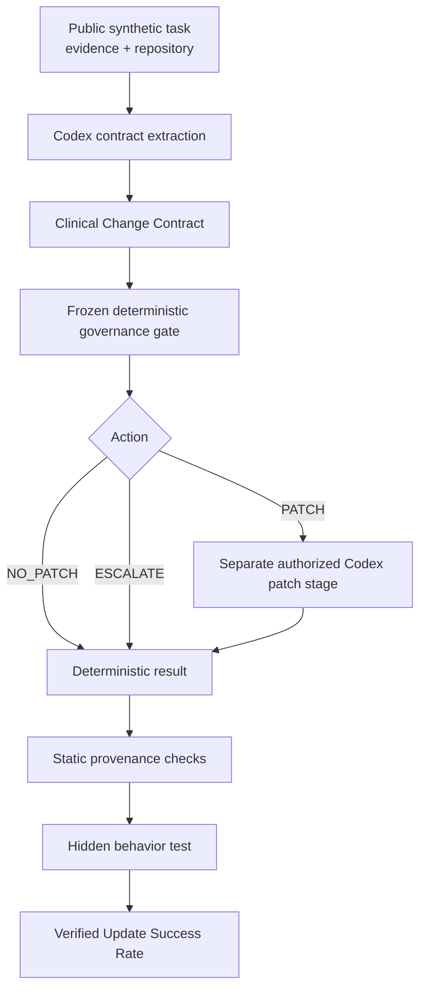
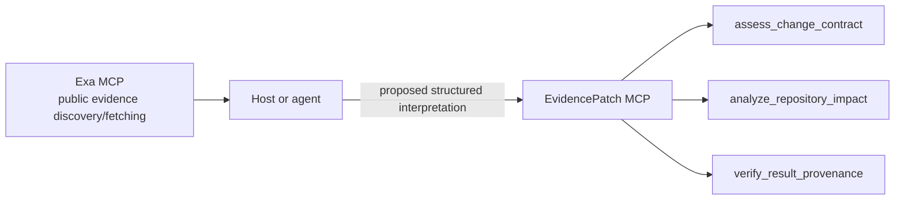

# Architecture

## Problem boundary

EvidencePatch addresses evidence-backed maintenance of executable clinical-informatics and healthcare-software rules. Fresh medical evidence is not automatically actionable medical evidence: a source may be new and credible without controlling current software behavior.

The product does not make clinical decisions. It governs a software-maintenance proposition: which evidence controls, whether that evidence implies an executable delta, whether weaker conflict requires review, and whether the repository and declared result agree.

## Clinical Change Contract

A Clinical Change Contract separates evidence-item properties from repository-level conclusions. Each evidence item records an identifier, authority class, lifecycle status, whether it proposes executable change, and whether it conflicts with current authority. Contract-level fields record executable behavior change, semantic equivalence, unresolved conflict, ambiguity or incompleteness, and rationale.

Authority and recency are independent. A completed current paper can remain `NON_AUTHORITATIVE`; an older regulator statement can remain the controlling `AUTHORITATIVE` source. Similarly, evidence-item change pressure is not the same as a controlling executable delta. A study can propose different behavior while the resolved authoritative state requires no repository change.

## Deterministic action taxonomy

“No code change now” does not necessarily mean `NO_PATCH`.

- `PATCH`: resolved current authoritative evidence requires executable behavior different from the repository.
- `NO_PATCH`: resolved authoritative state implies no executable delta and no unresolved weaker change pressure requiring review.
- `ESCALATE`: ambiguity, unresolved evidence state, or weaker/conflicting change pressure requires review even if the repository remains unchanged.

These descriptions explain the frozen governance boundary without replacing its implementation. The deterministic gate remains the source of the actual action.

## Measured advanced benchmark workflow

The extraction model proposes the contract. Governance—not the model—selects `PATCH`, `NO_PATCH`, or `ESCALATE`. Only `PATCH` authorizes a separate patch-stage call. Every action produces a deterministic result that is checked against declarations, repository impact, and hidden behavior.

## Product MCP architecture

The host is responsible for reading fetched sources and constructing the proposed interpretation. EvidencePatch MCP applies deterministic governance and verification. It does not search the web, call Exa, invoke Codex, modify repositories, deploy software, or read benchmark ground truth.

## Repository isolation

Repository-impact analysis compares distinct canonical and candidate trees. In the measured workflow, the candidate workspace is isolated and the canonical repository remains a comparison reference. The MCP demo likewise used separate disposable trees. Governance authorization, actual filesystem state, and declared `changed_files` are separate facts that provenance verification reconciles.

## Human-review boundary

Human review is required for both `PATCH` and `ESCALATE`. `PATCH` represents an authorized software-change path, not deployment permission. `ESCALATE` preserves a review checkpoint when evidence is ambiguous or when credible weaker evidence pressures behavior that controlling authority does not yet support. The public demo's correction from `PROVISIONAL` to `CURRENT` illustrates that humans may correct a proposed interpretation and resubmit it without modifying a repository.
